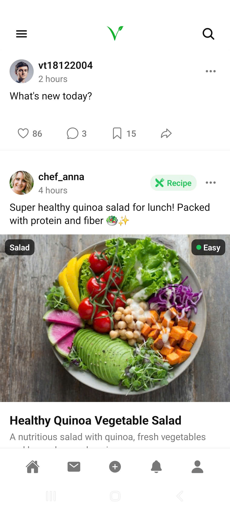
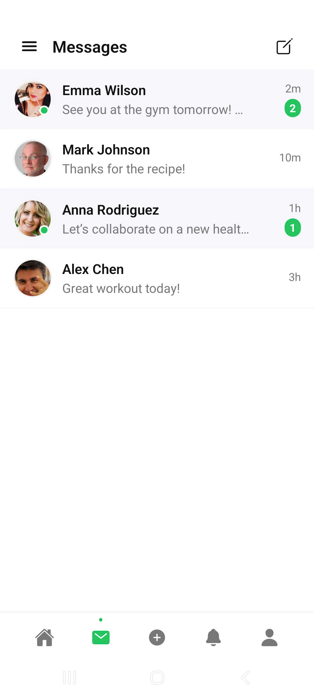
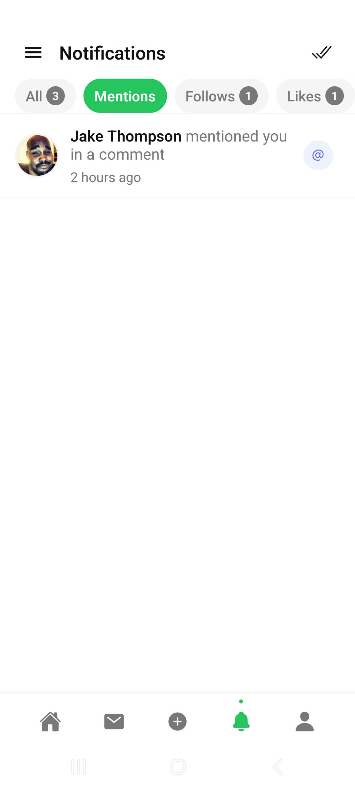
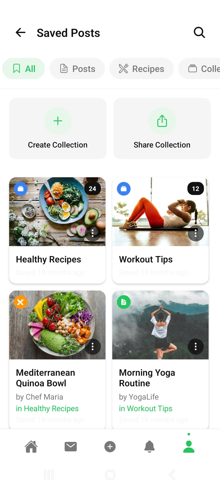
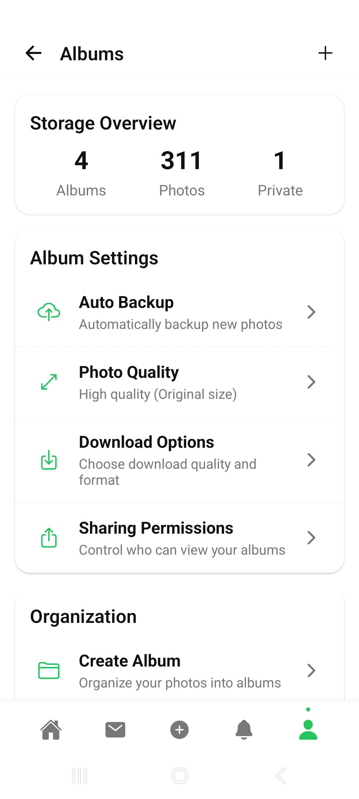
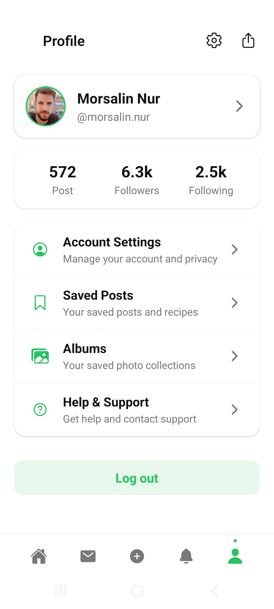
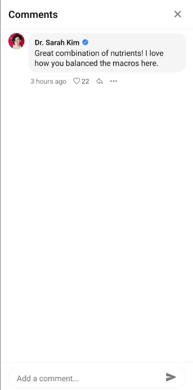

# Healthcare Social Network App



## 🩺 Project Overview

**Healthcare Social Network App** is a modern mobile social platform for the health-conscious community. The app enables users to share posts, recipes, connect with friends, chat, manage personal information, and interact with a vibrant wellness community.

## 🚀 Technologies Used

- **React Native (Expo)** — Cross-platform mobile development
- **TypeScript** — Type-safe, maintainable code
- **Apollo Client** — State management & GraphQL communication
- **NestJS** — Powerful, secure backend framework
- **Prisma ORM** — Efficient database management
- **PostgreSQL** — Robust relational database
- **GraphQL** — Modern, flexible API
- **React Native Paper, SafeAreaContext, etc.** — Modern UI/UX

## 🌟 Key Features

- **Sign Up / Login / Forgot Password**
- **Home Feed:** View posts, recipes, interact (like, comment, save, share)
- **Search:** Find users, posts, recipes, advanced filters
- **Messaging:** 1-on-1 chat, send messages, images
- **Notifications:** Receive updates on interactions, friends, system events
- **Profile:** View & edit personal info, stats, posts, about
- **Saved Posts/Recipes:** Manage your saved content
- **Albums:** Organize photo/recipe collections
- **Settings:** Account management, security, themes, help
- **Multi-language & Dark Mode support**

## 📸 UI Demo

| Home | Message | Notification | Saved Posts |
|------|---------|--------------|-------------|
|  |  |  |  |

| Albums | Setting | Comment | Login |
|--------|---------|---------|-------|
|  |  |  |  |

## 🏗️ Project Structure

```
/mobile
  /app         # Routing, layout, app config
  /components  # UI components (Button, Header, Profile, ...)
  /pages       # Main screens (home, profile, post, ...)
  /graphql     # GraphQL queries, mutations, fragments
  /services    # API services, auth, user
  /apollo      # Apollo Client config, cache, links
  /theme       # Colors, fonts, spacing
  /types       # Shared type definitions
  /hooks       # Custom hooks
  /constants   # Strings, constants
  /assets      # Images, fonts
/server
  /src         # Backend source code (NestJS)
  /prisma      # Schema, migrations, seed data
```

## ⚡ Quick Start

```bash
# 1. Clone the project
$ git clone <repo-url>
$ cd Healthcare app

# 2. Install dependencies for mobile
$ cd mobile
$ npm install

# 3. Install dependencies for server
$ cd ../server
$ npm install

# 4. Start the backend
$ npm run start:dev

# 5. Start the mobile app (Expo)
$ cd ../mobile
$ npx expo start
```

## 📬 Contact & Contribution
- **Author:** [VNDTVNDT]
- **Email:** vndt181204@gmail.com
- **Contribution:** All feedback, pull requests, and issues are welcome!

---

> **Healthcare Social Network App** — Connecting the healthy living community! 